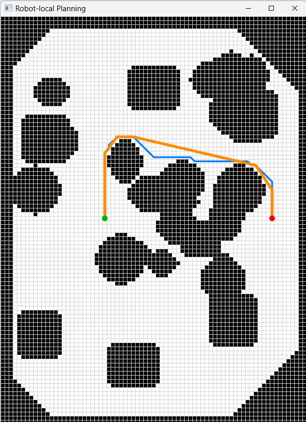
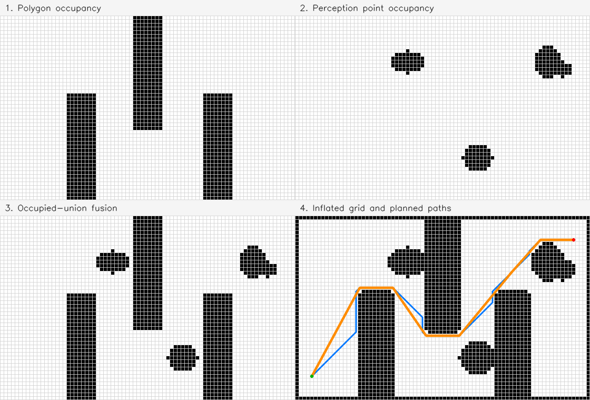

# AStarPlanner

[](https://www.apache.org/licenses/LICENSE-2.0)

AStarPlanner is a header-only C++17 library for two-dimensional occupancy-grid
planning. It combines polygon maps, world-coordinate perception points, safety
inflation, A*/Dijkstra/weighted-A* search, automatic line-of-sight path
simplification, and detailed OpenCV visualization.

## Why use this planner?

There are many open-source A* implementations. This project is not based on a
novel search algorithm and does not claim to be the absolute fastest planner.
Its goal is to provide a fast, useful planner whose complete workflow is easy to
understand, inspect, visualize, and debug.

The larger win is everything around the search:

- readable planner and occupancy-grid code;
- annotated demos that work as tutorials;
- live visualization of the frontier and expanded cells;
- clear before-and-after views of occupancy preprocessing;
- both original connected paths and simplified straight-line paths;
- polygon keep-out zones and optional operation areas;
- arbitrary perception-point obstacles for lidar or point-cloud-style inputs;
- diagnostics, repeatable benchmarks, and profiling tools.

<p align="center">
  
</p>

## What it supports

- Convex polygon obstacles in world coordinates
- Arbitrary world-coordinate obstacle points rasterized into occupied cells
- Occupied-union fusion of aligned polygon and perception grids
- Optional convex keep-in operation areas with obstacle clipping
- Forward/side/behind and centered-square local planning-bound helpers
- Safety inflation in world units
- Four- or eight-connected A*, Dijkstra, and weighted A*
- Configurable diagonal corner cutting and deterministic tie-breaking
- Automatic collision-checked path simplification
- Search, path, and preprocessing diagnostics
- Live search animation and reusable occupancy-grid rendering

The normal preprocessing and planning flow is:

```text
Application selects planningBounds and resolution
                        |
            Create planningGeometry
                        |
       +----------------+----------------+
       |                                 |
Rasterize polygons                Rasterize points
       |                                 |
  polygonGrid                     perceptionGrid
       +----------------+----------------+
                        |
                    fusedGrid
                        |
              Inflate once for safety
                        |
                  planningGrid
                        |
                     Planner
```

The application chooses the planning bounds. The planner does not require the
grid to be robot-centered and does not infer a planning horizon from sensor
range, start, goal, or obstacle positions.

Robot-oriented applications can create bounds around a position without making
the grid or planner robot-specific:

```cpp
const LocalPlanningRegion region =
    LocalPlanningRegion::forwardSideBehind(20.0, 10.0, 5.0);
const WorldBounds planningBounds = region.boundsAround(robotPosition);
```

## Documentation

| If you want to... | Read... |
|---|---|
| Build the project and run an example | This README |
| Implement polygon, perception, or combined planning | [Usage Guide](docs/USAGE_GUIDE.md) |
| Choose bounds, configure search, or use subgrids | [Usage Guide](docs/USAGE_GUIDE.md) |
| Look up a class, function, option, or result field | [API Guide](docs/API_GUIDE.md) |
| Verify exact behavior and exceptions | Public headers in [`include/`](include) |
| See executable behavior | Tests in [`tests/`](tests) and tutorials in [`demo/`](demo) |

## Quick start

### Requirements

- CMake 3.16 or newer
- A C++17 compiler
- [Eigen](https://eigen.tuxfamily.org/) for world-coordinate geometry
- OpenCV 4.5 or newer for occupancy storage and rasterization
- [MatPlotOpenCV](https://github.com/mwhannan74/MatPlotOpenCV) for the demos and
  polygon-environment visualization

Dependency locations are configurable through:

- `ASTAR_PLANNER_EIGEN3_INCLUDE_DIR`
- `ASTAR_PLANNER_MPOCV_SOURCE_DIR`
- `ASTAR_PLANNER_OPENCV_DIR`

Local defaults are kept in `cmake/local_paths.cmake`. Override them during CMake
configuration when dependencies are installed elsewhere.

### Configure and build

Windows with a multi-configuration generator:

```powershell
cmake -S . -B build -DMATPLOTOPENCV_BUILD_DEMO=OFF -DMATPLOTOPENCV_BUILD_DOCS=OFF
cmake --build build --config Release
```

With a single-configuration generator, select `-DCMAKE_BUILD_TYPE=Release`
during configuration and omit `--config Release` from build and CTest commands.

To build the core planner and tests without visualization demos:

```powershell
cmake -S . -B build -DASTAR_PLANNER_ENABLE_VISUALIZATION=OFF -DASTAR_PLANNER_BUILD_DEMO=OFF
cmake --build build --config Release
```

### Run the demos

```powershell
.\build\Release\a_star_planner_demo.exe
.\build\Release\operation_area_demo.exe
.\build\Release\perception_fusion_demo.exe
.\build\Release\robot_planning_demo.exe
```

| Demo | Shows |
|---|---|
| `a_star_planner_demo` | Polygon rasterization, inflation, planning, and both path forms |
| `operation_area_demo` | Keep-in operation area, obstacle clipping, and explicit planning bounds |
| `perception_fusion_demo` | Polygon occupancy, perception blobs, fusion, inflation, and planning |
| `robot_planning_demo` | Robot-local bounds with an operation area, polygon obstacles, perception blobs, and planning |

Add `--debug` to any demo to animate the search. An optional image filename
saves its visualization:

```powershell
.\build\Release\a_star_planner_demo.exe planner_result.png --debug
.\build\Release\perception_fusion_demo.exe perception_pipeline.png
.\build\Release\robot_planning_demo.exe robot_plan.png
```

The basic demo defaults to repeatable seed `7`; the perception and robot demos
default to fixed tutorial layouts. All three support fresh or repeatable
generated layouts. In the robot demo, the seed controls both perception blobs
and the goal:

```powershell
.\build\Release\a_star_planner_demo.exe --random
.\build\Release\a_star_planner_demo.exe --seed 42
.\build\Release\perception_fusion_demo.exe --random
.\build\Release\perception_fusion_demo.exe --seed 42
.\build\Release\robot_planning_demo.exe --random
.\build\Release\robot_planning_demo.exe --seed 42
```

Each random run prints its seed so it can be reproduced with `--seed N`.
`--random` and `--seed N` cannot be combined.

<p align="center">
  
</p>

The robot demo places the green robot/start inside an asymmetric local planning
region with equal forward and side distances and half as much space behind it.
Black cells combine the operation-area boundary, inflated rectangular keep-out
zones, and perception blobs. The blue line is the original connected A* path;
the orange line is its collision-checked simplified path to the red goal. In a
generated scenario, both the perception blobs and goal are controlled by the
printed seed.

<p align="center">
  
</p>

The four panels show polygon occupancy, perception-point occupancy, their
occupied-union fusion, and the final inflated grid with original and simplified
paths.

<p align="center">
  
</p>

### Run the tests

```powershell
ctest --test-dir build -C Release --output-on-failure
```

The main test executable can also be run directly:

```powershell
.\build\Release\a_star_planner_tests.exe
```

## Minimal integration example

This example uses polygons and perception points. Applications with only one
occupancy source can omit the unused rasterizer and fusion call.

```cpp
#include "a_star_grid_planner.hpp"
#include "a_star_planner.hpp"
#include "occupancy_grid.hpp"

using namespace astar;

const PolygonEnvironment environment(operationArea, polygonObstacles);
const GridGeometry geometry = GridGeometry::covering(
    planningBounds, resolution);

const OccupancyGrid polygonGrid = PolygonRasterizer::rasterize(
    geometry, environment);
const OccupancyGrid perceptionGrid = PointRasterizer::rasterize(
    geometry, obstaclePoints);
const OccupancyGrid fusedGrid = OccupancyGridFusion::occupiedUnion(
    polygonGrid, perceptionGrid);
const OccupancyGrid planningGrid = OccupancyGridInflator::inflate(
    fusedGrid, safetyRadius);

const auto start = planningGrid.geometry().worldToCell(worldStart);
const auto goal = planningGrid.geometry().worldToCell(worldGoal);
if (!start || !goal)
    return 1;

const AStarGridPlanner planner;
const GridPlanResult result = planner.plan(planningGrid, *start, *goal);
if (!result.succeeded())
    return 1;

const std::vector<Point2> simplifiedWorldPath =
    gridPathToWorld(planningGrid, result.simplifiedPath);
```

See the [Usage Guide](docs/USAGE_GUIDE.md) for the complete example, input
semantics, planning options, diagnostics, visualization, subgrids, and
performance tools.

## Using the library from CMake

When vendoring the repository with `add_subdirectory()`:

```cmake
set(ASTAR_PLANNER_BUILD_DEMO OFF CACHE BOOL "" FORCE)
set(ASTAR_PLANNER_BUILD_BENCHMARKS OFF CACHE BOOL "" FORCE)
set(ASTAR_PLANNER_ENABLE_VISUALIZATION OFF CACHE BOOL "" FORCE)
add_subdirectory(path/to/AStarPlanner EXCLUDE_FROM_ALL)

target_link_libraries(my_application
    PRIVATE
        AStarPlanner::astar_planner
)
```

Optional visualization targets are:

```cmake
AStarPlanner::astar_occupancy_grid_visualization
AStarPlanner::astar_planner_visualization
```

## Important boundaries

- Obstacles and operation areas must be convex simple polygons.
- Occupancy is binary; confidence, decay, and graded traversal costs are not
  implemented.
- Perception rasterization creates a fresh grid and does not accumulate sensor
  history.
- Fusion requires already aligned grids and does not resample or reproject.
- Path simplification produces straight collision-checked segments, not curves
  or vehicle-dynamics-constrained trajectories.
- The planner assumes a static occupancy grid during each request.

More detail is available in the [Usage Guide](docs/USAGE_GUIDE.md#design-boundaries).

## Project background

The repository began as a copy of VisGraphPlanner. The former visibility-graph
implementation has been removed; the active project is an occupancy-grid
planner. `AStarPlanner` remains as a deprecated compatibility alias for the
environment model. New code should use `PolygonEnvironment` and
`AStarGridPlanner` directly.

## License

AStarPlanner is licensed under the Apache License 2.0. See [LICENSE](LICENSE).

Copyright 2025-2026 Michael Hannan.
