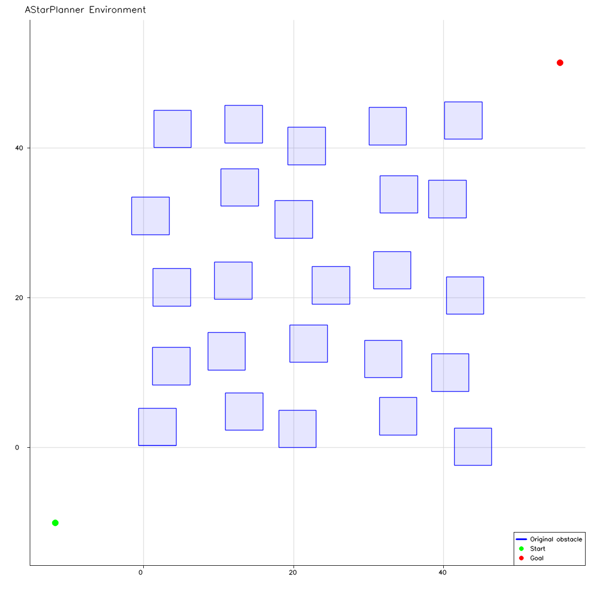
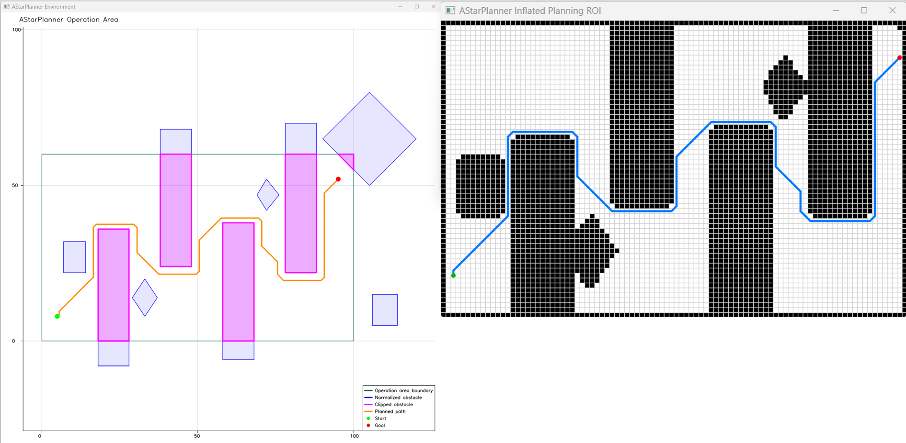

# AStarPlanner

[](https://www.apache.org/licenses/LICENSE-2.0)

AStarPlanner is being developed as a header-only C++17 library for A* path
planning on two-dimensional occupancy grids.

## Current development checkpoint

The repository began as a copy of VisGraphPlanner. The active code provides a
reusable environment model, occupancy grid, and initial A* planner. It supports:

- Eigen world-coordinate points and polygon obstacles
- convex polygon normalization and validation
- an optional convex operation area
- clipping obstacles to the operation area
- separate original, clipped, and effective obstacle views
- an OpenCV-backed binary occupancy grid
- world, Cartesian-grid, and OpenCV-image coordinate conversion
- explicit cell-sized, world-bounds-sized, and polygon-sized grids
- optional alignment to a stable world-coordinate lattice
- OpenCV-accelerated operation-area and obstacle rasterization
- master maps with shared or independently copied planning subgrids
- eight-connected A* search with optional four-connected movement
- unit orthogonal and `sqrt(2)` diagonal costs with matching heuristics
- optional diagonal corner cutting, disabled by default
- conversion of ROI-local grid paths to world-coordinate cell centers
- explicit planning outcomes for invalid terminals and unreachable goals
- optional environment visualization through MatPlotOpenCV
- direct OpenCV occupancy-grid visualization
- efficient OpenCV polyline overlays for ordered grid paths

The former visibility-graph implementation has been removed. The active planner
uses grid-based A* search with safe eight-connected movement by default.

## Assumptions and validation

- Obstacles and the optional operation area must be convex simple polygons.
- Clockwise polygons are normalized to counter-clockwise order.
- Repeated closing vertices, consecutive duplicates, and redundant collinear
  boundary vertices are removed.
- Non-finite, self-intersecting, degenerate, and concave polygons are rejected.
- Obstacle inputs with fewer than three vertices are ignored without producing
  library output.
- Obstacles are clipped to the operation area when one is configured.
- Empty, point-only, and line-only clipping results are discarded.
- Direct `PolygonRasterizer` inputs are independently normalized and validated;
  they must also describe convex simple polygons with nonzero area.
- Rasterization follows OpenCV `fillConvexPoly` pixel coverage. It is not a
  conservative rule that marks every cell touched by polygon geometry.

Polygon holes and overlapping-obstacle validation are not supported.

## Requirements

- CMake 3.16 or newer
- A C++17 compiler
- [Eigen](https://eigen.tuxfamily.org/) for world-coordinate geometry
- OpenCV 4.5 or newer for occupancy-grid storage
- [MatPlotOpenCV](https://github.com/mwhannan74/MatPlotOpenCV) for visualization and demos

The environment-only `a_star_planner.hpp` header does not include OpenCV.
The occupancy-grid API is provided by `occupancy_grid.hpp`.
Generic grid rendering is provided separately by
`occupancy_grid_visualization.hpp`; planner/environment plotting remains in
`a_star_planner_visualization.hpp`.

## Configure and build

Default local dependency paths are defined in `cmake/local_paths.cmake`:

- `ASTAR_PLANNER_EIGEN3_INCLUDE_DIR`
- `ASTAR_PLANNER_MPOCV_SOURCE_DIR`
- `ASTAR_PLANNER_OPENCV_DIR`

Configure and build all targets on Windows with a multi-configuration generator:

```powershell
cmake -S . -B build -DMATPLOTOPENCV_BUILD_DEMO=OFF -DMATPLOTOPENCV_BUILD_DOCS=OFF
cmake --build build --config Release
```

To build only the core environment model and tests:

```powershell
cmake -S . -B build -DASTAR_PLANNER_ENABLE_VISUALIZATION=OFF -DASTAR_PLANNER_BUILD_DEMO=OFF
cmake --build build --config Release
```

## Tests

Run the environment and occupancy-grid tests directly:

```powershell
.\build\Release\a_star_planner_tests.exe
```

Or use CTest:

```powershell
ctest --test-dir build -C Release --output-on-failure
```

## Demos

The two demos visualize both the retained polygon environment and its generated
occupancy grid. The deterministic operation-area demo also exercises a cropped
planning ROI and displays the obstacle-avoiding A* result.

```powershell
.\build\Release\a_star_planner_demo.exe
.\build\Release\operation_area_demo.exe
```

The first demo builds an explicit world-aligned rectangular grid around a
randomized field of polygon obstacles. The second builds a master grid directly
from the operation area's bounding box, paints that area free, and then paints
the effective obstacles occupied. The first demo plans on its complete master
grid. The second demonstrates a caller-selected ROI that deliberately retains
the space needed to route around its obstacle walls. Both demos report
grid-rasterization and planning time and display the path in the occupancy-grid
view and the world-coordinate MatPlotOpenCV figure. Pass an optional image
filename as the first argument to save the world-coordinate figure before its
windows are displayed.

A planning ROI restricts the search domain; it is not only a storage or display
crop. A path that exists in the master grid may require cells outside the ROI,
so `NoPath` means no path exists inside the supplied planning grid. Use the full
master grid when no safe application-specific planning window is known. An
automatic expanding-ROI retry policy is not currently provided.

<p align="center">
  
</p>

<p align="center">
  
</p>

## CMake targets

- `AStarPlanner::astar_planner` — header-only environment and occupancy-grid model
- `AStarPlanner::astar_occupancy_grid_visualization` — reusable OpenCV grid rendering
- `AStarPlanner::astar_planner_visualization` — optional planner and grid visualization support
- `a_star_planner_tests` — deterministic environment tests
- `a_star_planner_demo` — unconstrained-environment demo
- `operation_area_demo` — operation-area and clipping demo

## Basic usage

```cpp
#include "a_star_planner.hpp"
#include "occupancy_grid.hpp"

#include <vector>

int main()
{
    using namespace astar;

    std::vector<Polygon> obstacles{
        {
            Point2(0.0, 0.0),
            Point2(5.0, 0.0),
            Point2(5.0, 5.0),
            Point2(0.0, 5.0)
        }
    };

    const Polygon operationArea{
        Point2(-2.0, -2.0), Point2(8.0, -2.0),
        Point2(8.0, 8.0), Point2(-2.0, 8.0)
    };
    AStarPlanner planner(operationArea, obstacles);

    OccupancyGrid master = PolygonRasterizer::rasterize(
        planner.operationArea(), planner.obstacles(), 0.5);
    OccupancyGrid planningWindow = master.subgrid(
        WorldBounds{ Point2(-1.0, -1.0), Point2(6.0, 6.0) });

    return planningWindow.isTraversable({ 0, 0 }) ? 0 : 1;
}
```

`GridGeometry(origin, resolution, width, height)` provides explicit cell-sized
maps. `GridGeometry::covering(...)` derives rectangular cell dimensions from
world bounds or polygon bounds. `GridGeometry::alignedCovering(...)` additionally
keeps cell boundaries on a stable world lattice. A planning subgrid uses the
master resolution and records its cumulative master-cell offset; it can either
share an OpenCV ROI or own an independent copy.

## License

AStarPlanner is licensed under the Apache License 2.0. See `LICENSE` for the
full license text.

Copyright 2025-2026 Michael Hannan.
